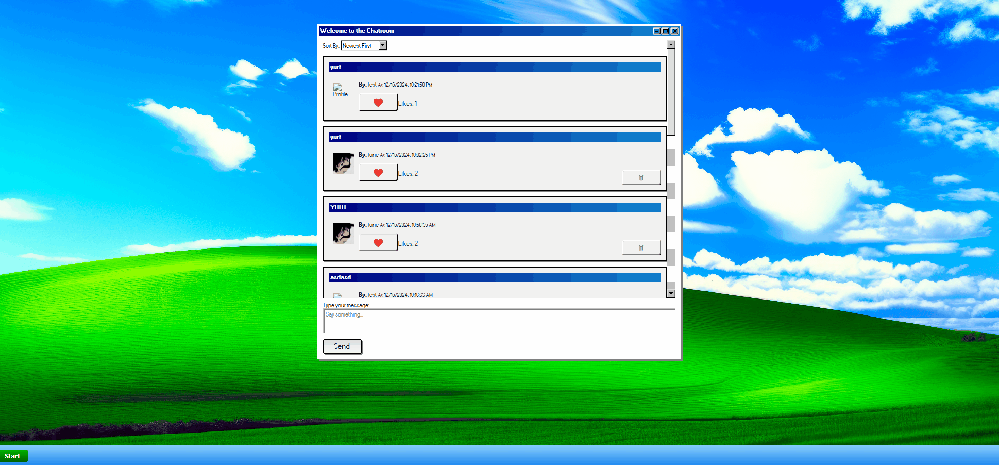

# Windows XP-Themed Chatroom Application

### A retro-inspired Windows XP-style chatroom featuring user authentication, real-time posts, likes, customizable user desktops, and a Webamp music player for personalized music playlists, built with **HTML**, **CSS**, **JavaScript**, **98.css**, and connected to the **MicroblogLite backend API**.

---

## **Features**

### **Chatroom Functionality**:

- View, post, and sort messages in a Windows XP-style chatroom.
- Like/unlike messages and delete your own posts.



### **User Authentication**:

- Secure login and registration with JWT authentication.


### **Customizable User Desktops**:

- Change desktop wallpapers with predefined or custom images.
- Wallpapers persist across sessions for each user.
- Drag-and-drop functionality for program windows.


### **Webamp Music Player Integration**:

- Personalized Webamp playlists for each user.
- Add and remove songs dynamically with persistent playlists stored via IndexedDB.
- User-specific songs and playlists remain available on login.
- Real-time updates between the Add Songs window and Webamp.


---

## **Technologies Used**

### **Frontend**:

- HTML, CSS, JavaScript.
- [98.css](https://jdan.github.io/98.css/) for retro Windows-inspired styling.

### **Backend**:

- [MicroblogLite](https://github.com/DevelopIntelligenceBoulder/microbloglite-capstone-backend) backend API for user authentication, posts, and likes.

### **Storage**:

- **`IndexedDB`** for storing user-specific songs and playlists.
- `localStorage` for saving wallpapers and user-specific settings.

---

## **Installation**

1. Clone the repository:
    
    ```bash
    git clone https://github.com/thounny/capstone-3.git
    cd capstone-3
    ```
    
2. Install the [MicroblogLite](https://github.com/DevelopIntelligenceBoulder/microbloglite-capstone-backend#local-mongodb-database) backend (if applicable):
<br><br><mark>Note:</mark> Local MongoDB database
- If you want to run this API server with a **locally-installed database**, make sure MongoDB is installed on your machine and running as a service. To run the API server using this local database, simply run `npm run local` or `npm run local-watch`.
    
- If you get the error "PORT 5005 is already in use," you may have to stop a server which is already using that port, or you can override the port used by the MicroblogLite API server by modifying `PORT=5005` in the `"local"` script in `package.json` (choose a number between 3000 and 9000).
    
    For example, changing the PORT to 7337 would look like this:
    ```json
                             ↓↓↓↓
    "local": "cross-env PORT=7337 NODE_ENV=development JWT_SECRET=foobar node ./bin/www",
    ```
3. Open the project locally:
    - Simply open `index.html` in your browser.

---

## **Usage**

### **Login**:

- Navigate to `index.html` to log in.

### **Register**:

- If you don’t have an account, use `register.html` to create one.

### **Chatroom**:

- Access the chatroom via `posts.html` to view, create, and interact with posts.

### **Customize Desktop**:

- Use `profile_page.html` to:
    - Change your desktop wallpaper with predefined or custom images.
    - Add and remove songs dynamically with real-time Webamp updates.
### **Webamp Music Player**:

- Open the Webamp player from the desktop or Start Menu.
- Import songs using the "Add Songs" program.
- Enjoy user-specific playlists that persist across sessions.

---

## **File Structure**

```
/CAPSTONE-3
  /icons
    webamp-desktop.png           # Icon for Webamp Music Player
    wia_img_color-0.png          # Icon for Change Wallpaper
  /scripts
    auth.js                      # Handles user authentication
    config.js                    # Centralized app configuration
    landing.js                   # Handles logic for the landing page
    posts.js                     # Manages posts functionality for the chatroom
    profile_page.js              # Handles desktop customization and Webamp integration
    profile.js                   # Handles user-specific profile actions
    register.js                  # Handles user registration logic
    taskbar.js                   # Manages taskbar functionality
  /styles
    bliss.jpg                    # Example image file for wallpapers
    global.css                   # Global styles
    landing.css                  # Styles for the landing page
    posts.css                    # Styles for the chatroom
    profile.css                  # Styles for user profiles
    profile_page.css             # Styles for user desktops
  LICENSE                        # Project license file
  index.html                     # Login page
  posts.html                     # Chatroom page
  profile_page.html              # User desktop page
  profile.html                   # Profile page
  README.md                      # Project readme
  register.html                  # Registration page
```

---

## **API Endpoints**

### **Authentication**

- `POST /auth/login` - Logs in a user.
- `GET /auth/logout` - Logs out a user.

### **Users**

- `POST /api/users` - Registers a new user.
- `GET /api/users` - Retrieves all users.
- `GET /api/users/:username` - Retrieves a specific user’s details.

### **Posts**

- `GET /api/posts` - Retrieves all posts.
- `POST /api/posts` - Creates a new post.
- `DELETE /api/posts/:postId` - Deletes a specific post.

### **Likes**

- `POST /api/likes` - Likes a post.
- `DELETE /api/likes/:likeId` - Unlikes a post.

---

## **Webamp-Specific Features**

- **Real-Time Playlist Management**:
    - Add or remove songs dynamically through the "Add Songs" program.
    - Reflect changes instantly in Webamp.
- **Persistent Playlists**:
    - Songs are saved in IndexedDB and retrieved when users log back in.
    - Each user's playlist is isolated and private.
- **Drag-and-Drop Windows**:
    - Add Songs and Webamp player windows can be repositioned on the desktop.

---
## **License**

This project is licensed under the MIT License.

---

## **Acknowledgments**

- **[98.css](https://jdan.github.io/98.css/)** for retro styling inspiration.
- **MicroblogLite Backend API** for providing the backend functionality.
- **[Webamp](https://webamp.org/)** for the iconic media player.
- **IndexedDB API** for enabling efficient storage and retrieval of user-specific music playlists.
- Windows XP for the timeless inspiration.
